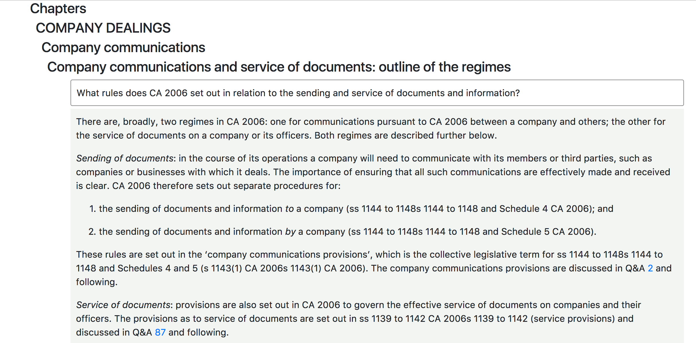

### Set up

```
npm install
npm start
open http://localhost:3000
```

### Task

To test your programming skill, we'd like you to have a go at a small task.

We have provided you with four JSON files (in /data). These files provide you with a table of contents (sections.json), questions (/[\d]+(,[\d]+)+/.json), and a list of view states (states.json). Your task is to use this data to produce a content view page.

You should start with loading data from all four files. The view should display sections and questions altogether and the content tree hierarchy should be easy to read. All questions should remain collapsed unless their tocId is on expanded list.

The starting state should leave all questions collapsed and the UI should include a button allowing to cycle through the view states list.


Some things to note:
* Your solution should work in any modern browser, but you don't need to worry about making it fully cross browser or supporting older browsers.
* The root of the sections tree has id -1.
* Simplicity is key.
* Remember to make use of the app states provided.
* There's no need to make requests to load data, keep it static.
